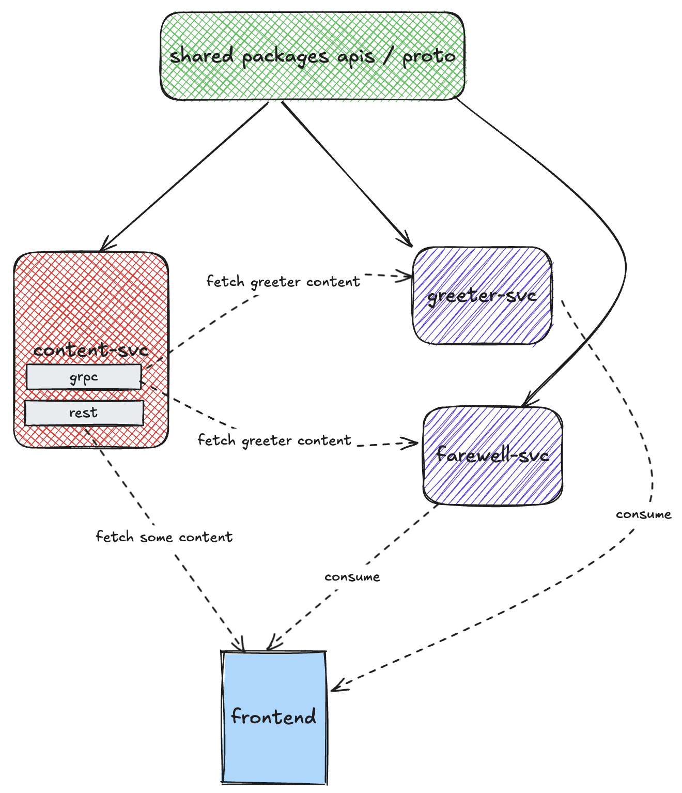

# echoing app

this is for getting started with dapr monorepo onboarding.

## diagram


## development mode

```sh
yarn install --frozen-lockfile
yarn dev
# or
docker compose -f docker-compose.dev.yaml up -d
# rebuild
docker compose -f docker-compose.dev.yaml up --build -d
```

## production mode
```bash
yarn install --frozen-lockfile
yarn build
yarn start
```
